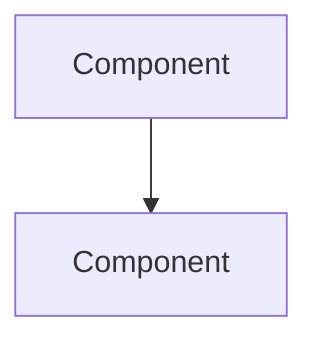
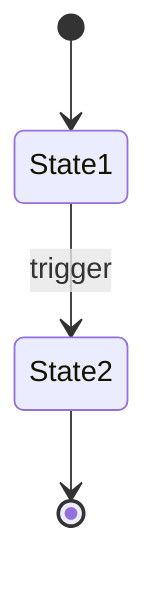

# Engineering Review

> **Inspired by**: gstack's `/plan-eng-review` by [Garry Tan](https://github.com/garrytan/gstack) (MIT License).
> **Adapted for**: Solo founder, backend-heavy projects (Supabase edge functions, agent pipelines, etc.).

This skill fires after the CEO Plan Review approves the plan and before building begins. It is the **eng manager brain** — not more ideation, but making the vision buildable.

<!-- GSTACK CHERRY-PICK START: v1.27.1.0 anti-shortcut clause (Garry Tan, gstack MIT) -->
> **⚠️ Anti-shortcut clause**: The engineering review is the OUTPUT of an interactive review, not a substitute for it. Writing every finding into one plan write and calling `ExitPlanMode` without firing `AskUserQuestion` is the precise failure mode this skill exists to prevent — the model explored, found issues, and dumped them into a deliverable rather than walking the user through them. If you have ANY non-trivial finding in any review section, the path from finding to `ExitPlanMode` goes THROUGH `AskUserQuestion`. Zero findings in every section is the only path to `ExitPlanMode` that bypasses `AskUserQuestion`. If you find yourself wanting to write a plan with findings before asking, stop and call `AskUserQuestion` now — that's the bug, recognize it.
<!-- GSTACK CHERRY-PICK END -->

## When This Triggers

**Mandatory** when:
- CEO Plan Review just completed with approval
- The plan touches 3+ files or introduces new architecture
- New data flows, state machines, or pipeline changes are involved

**Skip** when:
- Plan is 1-2 files with no new architecture
- Bug fixes with obvious scope
- CEO Review recommended skipping straight to build

## Philosophy

The CEO reviewed the WHAT and WHY. You review the HOW.

Your job is to find every hidden assumption, draw every flow, name every failure mode, and produce a document that an engineer (or future AI session) can build from without guessing.

**You are not here to dream bigger.** The scope is set. You are here to make it bulletproof.

## Cognitive Patterns — How Great Eng Managers Think

These are not checklist items. They are the instincts that experienced engineering leaders develop — the pattern recognition that separates "reviewed the code" from "caught the landmine." Apply them throughout your review.

1. **Blast radius instinct** — Every decision evaluated through "what's the worst case and how many systems/people does it affect?"
2. **Boring by default** — "Every company gets about three innovation tokens." Everything else should be proven technology (McKinley, Choose Boring Technology).
3. **Incremental over revolutionary** — Strangler fig, not big bang. Canary, not global rollout. Refactor, not rewrite (Fowler).
4. **Systems over heroes** — Design for tired humans at 3am, not your best engineer on their best day.
5. **Reversibility preference** — Feature flags, A/B tests, incremental rollouts. Make the cost of being wrong low.
6. **Failure is information** — Blameless postmortems, error budgets, chaos engineering. Incidents are learning opportunities (Allspaw, Google SRE).
7. **Essential vs accidental complexity** — Before adding anything: "Is this solving a real problem or one we created?" (Brooks, No Silver Bullet).
8. **Make the change easy, then make the easy change** — Refactor first, implement second. Never structural + behavioral changes simultaneously (Beck).
9. **Own your code in production** — No wall between dev and ops. The engineer who wrote it owns it running.

When evaluating architecture, think "boring by default." When reviewing tests, think "systems over heroes." When assessing complexity, ask Brooks's question.

## Inputs

- The approved `implementation_plan.md` from CEO Plan Review
- The relevant architecture docs (check `TRACE_MAP.md`)
- The current codebase state

## Step 0: Scope Challenge

Before reviewing anything, answer these questions:

1. **What existing code already partially or fully solves each sub-problem?** Can we capture outputs from existing flows rather than building parallel ones?
2. **What is the minimum set of changes that achieves the stated goal?** Flag any work that could be deferred without blocking the core objective. Be ruthless about scope creep.
3. **Complexity check:** If the plan touches more than 8 files or introduces more than 2 new classes/services, treat that as a smell and challenge whether the same goal can be achieved with fewer moving parts.
4. **Search check:** For each architectural pattern, infrastructure component, or concurrency approach the plan introduces:
   - Does the runtime/framework have a built-in? Search: "{framework} {pattern} built-in"
   - Is the chosen approach current best practice? Search: "{pattern} best practice {current year}"
   - Are there known footguns? Search: "{framework} {pattern} pitfalls"
   If the plan rolls a custom solution where a built-in exists, flag it as a scope reduction opportunity.
5. **Completeness check:** Is the plan doing the complete version or a shortcut? With AI-assisted coding, the cost of completeness (full edge case handling, complete error paths) is 10-100x cheaper than with a human team. If the plan proposes a shortcut that saves only minutes with AI coding, recommend the complete version. Boil the lake.
6. **Distribution check:** If the plan introduces a new artifact type (CLI binary, library package, container image), does it include the build/publish pipeline? Code without distribution is code nobody can use.

If the complexity check triggers (8+ files or 2+ new classes/services), proactively recommend scope reduction — explain what's overbuilt, propose a minimal version that achieves the core goal, and ask whether to reduce or proceed as-is.

---

<!-- HARNESS INTEGRATION START -->
## Step 0.5: Harness Architecture Lenses (cross-check)

Before the architecture review, cross-check the plan against the Harness Architecture Lenses (`~/Documents/GitHub/harness/FIRST_PRINCIPLES.md` → "The Questioning Framework"):

- Does this **ride a primitive that's improving** (capability + cost), or compete with it? (Principles #2, #10, #18)
- Does it **preserve human attention** for what matters? (#17 — asymmetric attention is the leverage point)
- Is the **spec clear** enough to be a real spec? (#16 — specification is the bottleneck)
- Is it **dynamic-by-user**, or static? (#12)
- Does it honor **complementary strengths** — using the right intelligence type for each part of the work? (#14)
- Are **wisdom and intelligence** in the right places (wisdom directing, intelligence executing)? (#15)
- Is the **structure right** — or is a rewrite cheaper than incremental refactor? (anti-fallacy on sunk-cost-dressed-as-Kaizen)

If any lens raises a concern, surface it before drawing the architecture diagram. The Eng cognitive patterns below (boring by default, blast radius, reversibility preference, etc.) layer applied expert wisdom on top of the Harness substrate — they're complementary, not redundant.
<!-- HARNESS INTEGRATION END -->

---

## Review Sections

### 1. Architecture Diagram

Draw the system as a mermaid diagram. Include:
- Component boundaries (frontend, edge functions, database, external APIs)
- Data flow direction and format
- Which components are new vs modified vs existing



**Rule**: If you can't draw it, you don't understand it well enough to build it.

### 2. Data Flow Analysis

For EVERY new data flow, trace all four paths:

| Path | Description | What happens |
|------|-------------|-------------|
| **Happy** | Everything works | Describe |
| **Nil input** | Field is null/undefined | Describe |
| **Empty input** | Field exists but empty/zero-length | Describe |
| **Upstream error** | Previous step failed | Describe |

### 3. State Machines

For every new stateful object, draw the state machine:



List illegal state transitions and what prevents them.

### 4. Failure Mode Catalog

| Failure | Trigger | Detection | Recovery | User sees |
|---------|---------|-----------|----------|-----------|
| Name it | What causes it | How we know | What happens | Error message/behavior |

**Rule**: If a failure can happen silently, that is a critical defect.

### 5. Boundary Analysis

- What are the trust boundaries? (Frontend ↔ Edge Function ↔ Database ↔ External API)
- What data crosses each boundary?
- What validation happens at each boundary?
- RLS implications?

### 6. Test Matrix

| Scenario | Type | Input | Expected Output | Priority |
|----------|------|-------|-----------------|----------|
| Happy path | Integration | ... | ... | P0 |
| Edge case | Unit | ... | ... | P1 |

### 6b. Test Plan Artifact

Write the test matrix to `.agent/test-plans/{feature-slug}.md` so it persists across sessions and can be referenced during QA testing:

```markdown
# Test Plan: {Feature Name}
Generated by Engineering Review on {date}
Branch: {branch}

## Test Matrix
[copy the test matrix table from Section 6]

## Manual Verification Steps
[enumerate browser-testable scenarios for QA Testing skill]

## Regression Risks
[areas where existing behavior could break]
```

The QA Testing skill should check `.agent/test-plans/` for an existing test plan before generating its own scope.

### 7. Parallelization Strategy

Analyze the plan for parallel execution across workstreams. This feeds into the `Parallel Session Orchestration` skill.

| Lane | Files/Components | Depends On | Conflict Risk |
|------|-----------------|------------|---------------|
| Lane A: [name] | [files] | Nothing | — |
| Lane B: [name] | [files] | Lane A step N | [describe] |

**Rules:**
- Two lanes conflict if they touch the same file, the same DB table, or the same RLS policy
- A lane depends on another if it imports a function/type defined by that lane
- Mark conflict risk: NONE (fully parallel), LOW (shared types only), HIGH (shared files)

**Execution order:**
1. Start all NONE-conflict lanes simultaneously
2. LOW-conflict lanes start after their dependency commits
3. HIGH-conflict lanes are sequential

If the plan is small enough that parallelization adds overhead without benefit (≤3 files, single component), write: "Single-lane execution — parallelization overhead not justified."

### 8. Deployment Plan

- Can this be deployed incrementally or must it be atomic?
- What happens if the deploy is partial (edge function updated, but migration not yet run)?
- Rollback plan?
- Feature flag needed?

### 8. Cross-Pipeline Check (if your project has parallel pipelines)

If your project runs the same logic across multiple entry points (e.g. an interactive chat function and a background agent runner), check that the change lands in **all** of them. If your project has a parity map (`pipeline-parity-map.md` or equivalent), reference it. If not, manually walk the call sites that should mirror each other.

Skip this step entirely if the project has a single execution path.

## Output

Append the engineering review to the existing `implementation_plan.md` under a new `## Engineering Review` header. Do NOT create a separate document.

**Format for the review pass**: if the appended review exceeds ~100 lines or contains diagrams, comparative tables, or failure-mode matrices, render it as **HTML** for the user's review before committing the markdown to the codebase. Reason: render-rich format preserves diff highlighting, mermaid rendering, and table structure that markdown-in-chat scrollback fragments. See FIRST_PRINCIPLES.md → 📐 Heuristics → "Render-rich format for review-heavy output." The review draft is HTML in a session-served path (operator-configured); the final approved artifact is markdown in the project folder.

## Quality Gate

Before approving for build, confirm:
- [ ] At least one mermaid diagram exists
- [ ] All data flows have 4 paths traced
- [ ] Failure mode catalog has ≥ 3 entries
- [ ] Test plan artifact written to `.agent/test-plans/`
- [ ] Deployment plan addresses partial deploy
- [ ] Cross-pipeline check answered
- [ ] Parallelization strategy defined (or single-lane noted)

### Lake Score

Rate how completely the plan was boiled (0-10):

```
LAKE SCORE: __/10
Every edge case mapped?      [yes/no — which are missing?]
Every failure mode handled?   [yes/no — which are deferred?]
Every test scenario covered?  [yes/no — coverage gaps?]
Parallel lanes identified?    [yes/no — how many?]
```

A 10 means nothing was deferred, every edge case has handling, every failure mode has recovery.
Below 8, list what was left un-boiled and why.

---

## ➡️ Next Step in the Build Chain

> After the user approves the engineering review:
>
> **If the plan touches UI:**
> "Architecture verified. Proceed to build. After building, run `QA Testing` to verify functionality, then `Design Audit` for visual quality. Then `/deploy`."
>
> **If backend-only:**
> "Architecture verified. Proceed to build. After building, run `QA Testing` if there are UI implications, or `/deploy` directly."

